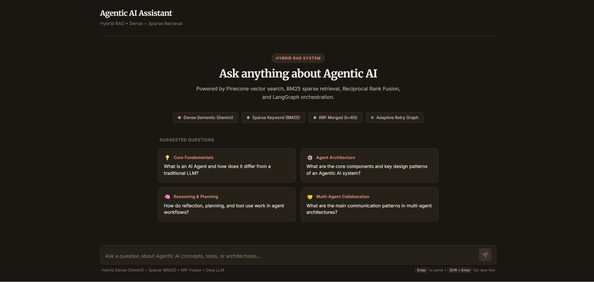
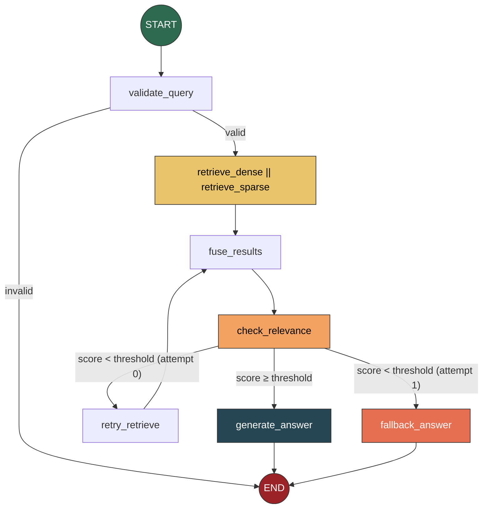
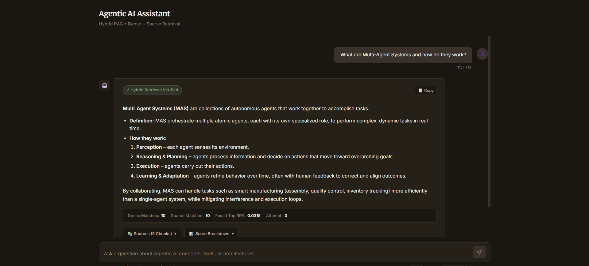
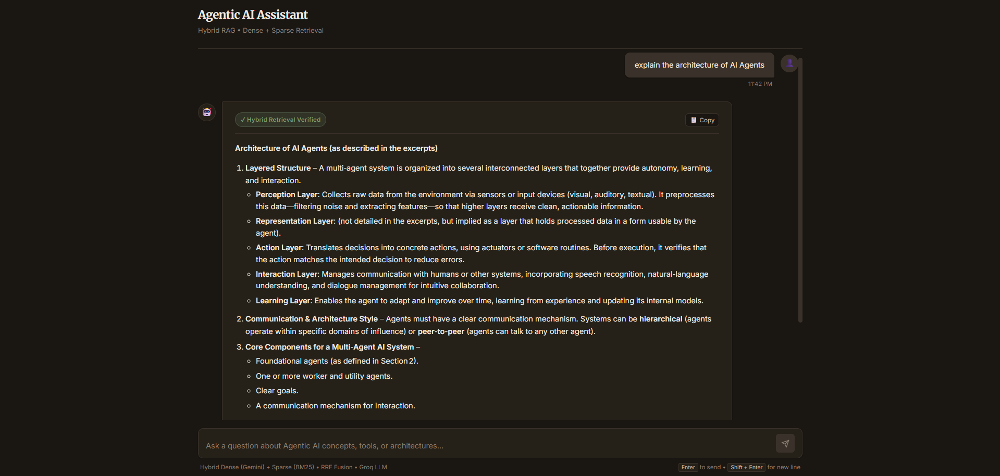

# Hybrid RAG System — Agentic AI Ebook Q&A

A Python‑based **Retrieval‑Augmented Generation** system that answers questions from the *Agentic AI Ebook* using hybrid retrieval (dense vector search + BM25 keyword matching) combined with Reciprocal Rank Fusion (RRF).



---

## Table of Contents

- [Why Hybrid Retrieval?](#why-hybrid-retrieval)
- [Tech Stack](#tech-stack)
- [System Architecture](#system-architecture)
- [LangGraph Pipeline](#langgraph-pipeline)
- [Ingestion Pipeline](#ingestion-pipeline)
- [Project Structure](#project-structure)
- [Getting Started](#getting-started)
- [Sample Queries & Answers](#sample-queries--answers)
- [Retrieval Evaluation](#retrieval-evaluation)
- [Screenshots & Demo](#screenshots--demo)

---

## Why Hybrid Retrieval?

Hybrid retrieval combines **dense semantic search** (Pinecone + Gemini embeddings) with **sparse keyword matching** (BM25) and merges results via **Reciprocal Rank Fusion**. This yields higher relevance, especially on hard queries, where the fused approach outperforms either method alone.

---

## Tech Stack

| Layer | Technology | Role |
|---|---|---|
| **PDF Extraction** | `pymupdf4llm` | Converts the ebook PDF into clean markdown per page |
| **Chunking** | `langchain-text-splitters` (RecursiveCharacterTextSplitter) | Splits pages into 1000-char chunks with 150-char overlap |
| **Embeddings** | Google `gemini-embedding-001` (768-dim) | Dense vector representations for semantic search |
| **Vector Store** | Pinecone (Serverless, cosine similarity) | Stores and queries document embeddings |
| **Keyword Index** | `rank-bm25` (BM25Okapi) | In-memory sparse retrieval over pre-tokenized corpus |
| **Fusion** | Reciprocal Rank Fusion (k=60) | Merges dense + sparse results into one ranked list |
| **Orchestration** | LangGraph (StateGraph + MemorySaver) | Controls the full retrieve → fuse → check → generate pipeline |
| **LLM** | Groq (`openai/gpt-oss-20b`, temperature=0) | Generates grounded answers from retrieved context |
| **API** | FastAPI + Uvicorn | REST endpoint (`POST /query`) serving the pipeline |
| **Frontend** | React 18 + Vite | Chat interface showing answers, sources, and scores |

---

## System Architecture

The system has three main layers: **Ingestion**, **Retrieval + Generation**, and **Serving**.

```
┌─────────────────────────────────────────────────────────────────────────┐
│                          INGESTION                  │
│                                                                         │
│  PDF ──► Extract ──► Clean ──► Chunk ──► Embed (Gemini) ──► Pinecone   │
│   │        (pymupdf4llm)  (artifacts,    (1000 chars,                   │
│   │                        ligatures)     150 overlap)                  │
│   │                                                                     │
│   └──────────────────────────────────► BM25 Corpus (.jsonl, tokenized)  │
└─────────────────────────────────────────────────────────────────────────┘

┌─────────────────────────────────────────────────────────────────────────┐
│                    QUERY PIPELINE (per request, via LangGraph)          │
│                                                                         │
│  User Question                                                          │
│       │                                                                 │
│       ▼                                                                 │
│  ┌─────────────┐                                                        │
│  │  Validate   │──── invalid ────► Return error message                 │
│  │   Query     │                                                        │
│  └──────┬──────┘                                                        │
│         │ valid                                                         │
│         ▼                                                               │
│  ┌──────────────┐    ┌──────────────┐                                   │
│  │  Dense Search │    │ Sparse Search│   ◄── run in parallel            │
│  │  (Pinecone)   │    │   (BM25)     │                                  │
│  └──────┬────────┘    └──────┬───────┘                                  │
│         │                    │                                          │
│         └────────┬───────────┘                                          │
│                  ▼                                                      │
│         ┌────────────────┐                                              │
│         │  RRF Fusion    │  score += 1/(k + rank)  per list             │
│         │  (k=60, top-5) │                                              │
│         └───────┬────────┘                                              │
│                 ▼                                                       │
│         ┌────────────────┐                                              │
│         │ Check Relevance│  top RRF score ≥ 0.01 ?                      │
│         └───────┬────────┘                                              │
│            ╱         ╲                                                  │
│         yes            no (attempt 0)                                   │
│          │              │                                               │
│          ▼              ▼                                               │
│    ┌───────────┐  ┌──────────────┐                                      │
│    │ Generate  │  │   Retry      │  (wider k, 2x candidates)            │
│    │  Answer   │  │  Retrieve    │──► fuse ──► check again              │
│    │  (Groq)   │  └──────────────┘         ╲                            │
│    └───────────┘                     still low? ──► Fallback Answer     │
│                                                                         │
└─────────────────────────────────────────────────────────────────────────┘

┌─────────────────────────────────────────────────────────────────────────┐
│                          SERVING LAYER                                  │
│                                                                         │
│    FastAPI (POST /query)  ◄──►  React Frontend (chat UI)               │
│    Returns: answer, sources (chunk_id, page, label, text), scores      │
└─────────────────────────────────────────────────────────────────────────┘
```

---

## LangGraph Pipeline

The entire query flow is modeled as a **LangGraph StateGraph** with conditional edges, parallel fan-out, and a retry loop. Here's the exact graph:



**What each node does:**

| Node | Purpose |
|---|---|
| `retrieve_dense` | Embeds the question with Gemini and queries Pinecone for top-10 nearest chunks |
| `retrieve_sparse` | Tokenizes the question and runs BM25 scoring against the pre-built corpus (top-10) |
| `fuse_results` | Merges both candidate lists using RRF (`score += 1/(60 + rank)`) and picks the top-5 |
| `check_relevance` | Compares the top RRF score against a threshold (0.01) to decide if chunks are relevant enough |
| `retry_retrieve` | On first failure, re-runs both retrievals with 2x wider top-k to cast a broader net |
| `generate_answer` | Sends the top-5 chunks + question to Groq LLM with a grounded system prompt |
| `fallback_answer` | Returns a polite "I couldn't find relevant info" message if both attempts fail |

The graph is compiled with `MemorySaver` checkpointer, so each `thread_id` gets its own conversational memory — useful for multi-turn sessions.

---

## Ingestion Pipeline

The ingestion runs in two stages that can be executed together or independently:

**Stage A — Process & Save (no API calls):**

```
PDF  →  extract_pages()  →  clean_pages()  →  chunk_pages()
         (pymupdf4llm)      (fix ligatures,    (RecursiveCharacterTextSplitter
                              drop empty         1000 chars, 150 overlap)
                              pages)
                                                    ↓
                                            chunks.jsonl  +  bm25_corpus.jsonl
```

**Stage B — Embed & Store (API calls):**

```
chunks.jsonl  →  embed each chunk (Gemini, task=RETRIEVAL_DOCUMENT)
                     ↓
              Pinecone upsert (batches of 100, cosine similarity)
                     ↓
              verify vector count matches chunk count
```

Each chunk carries metadata: `chunk_id`, `page_num`, `source`, `label` (one of `introduction`, `core_concept`, `case_study`, `conclusion` — assigned by keyword heuristics).

Run commands:

```bash
# Full pipeline (both stages)
python -m ingest.run_ingest

# Stage A only — no Pinecone needed
python -m ingest.run_ingest --metadata-only

# Stage B only — needs chunks.jsonl from Stage A
python -m ingest.run_ingest --embed-only
```

---

## Project Structure

```
RAG_Project/
├── api/             # FastAPI backend
├── ingest/          # PDF processing, chunking & embeddings
├── src/
│   ├── graph/       # LangGraph pipeline
│   ├── retrieval/   # Pinecone, BM25 & RRF
│   └── llm/         # LLM & prompts
├── frontend/        # React chat UI
├── tests/           # Retrieval evaluation
├── results/         # Evaluation results
├── screenshots/     # Screenshots & demo
├── data/            # Processed document data
├── requirements.txt
├── run.py
└── README.md
```

---

## Getting Started

### Prerequisites

- Python 3.11+
- Node.js 18+ (for the frontend)
- API keys for: **Google Gemini**, **Groq**, **Pinecone**

### 1. Clone & Set Up Environment

```bash
git clone <repo-url>
cd RAG_Project

python -m venv venv
venv\Scripts\activate        # Windows
# source venv/bin/activate   # Linux/Mac

pip install -r requirements.txt
```

### 2. Configure Environment Variables

Create a `.env` file in the project root:

```env
GOOGLE_API_KEY=your_gemini_api_key
GROQ_API_KEY=your_groq_api_key
PINECONE_API_KEY=your_pinecone_api_key
PINECONE_REGION=us-east-1
PINECONE_INDEX_NAME=rag-task
```

### 3. Run the Ingestion Pipeline

```bash
python -m ingest.run_ingest
```

This extracts the PDF, chunks it, embeds with Gemini, and upserts to Pinecone. Takes a few minutes on first run.

### 4. Start the API Server

```bash
uvicorn api.main:app --reload --port 8000
```

The API loads the LangGraph and BM25 index into memory at startup. Health check: `GET http://localhost:8000/health`

### 5. Start the Frontend

```bash
cd frontend
npm install
npm run dev
```

Open `http://localhost:5173` — the chat UI connects to the FastAPI backend at `localhost:8000`.

### 6. (Optional) Terminal Test Runner

To test the pipeline without the frontend:

```bash
python run.py
```

This prints dense results, sparse results, RRF scores, and the final answer to the terminal.

---

## Sample Queries & Answers

Below are sample queries run through the system, showing the generated answer, source chunks, and retrieval scores. These demonstrate the system handles easy factual lookups, medium synthesis questions, hard cross-chapter reasoning, and out-of-scope rejection.

---

### Query 1: "What is an AI Agent and how does it differ from a traditional LLM?"


**Answer (summarized):** An AI Agent is a goal-driven system with four key capabilities — autonomy, memory, social ability & communication, and constitution (safety guardrails). Unlike a traditional LLM that just generates text, an AI Agent adds goal-oriented autonomy, memory, interaction, and policy compliance, enabling it to *perform actions* in a dynamic environment rather than just respond to prompts.

| Source Chunk | Page no | Label | RRF Score |
|---|---|---|---|
| `Ebook-Agentic-AI_p6_c1` | 6 | core_concept | 0.0303 |
| `Ebook-Agentic-AI_p6_c2` | 6 | core_concept | 0.0295 |
| `Ebook-Agentic-AI_p7_c1` | 7 | core_concept | 0.0290 |
| `Ebook-Agentic-AI_p5_c2` | 5 | core_concept | 0.0285 |
| `Ebook-Agentic-AI_p8_c1` | 8 | core_concept | 0.0280 |

**Retrieval stats:** Dense Matches: 10 · Sparse Matches: 10 · Fused Top RRF: 0.0303 · Attempt: 0

---

### Query 2: "What are Multi-Agent Systems and how do they work?"



**Answer (summarized):** Multi-Agent Systems (MAS) are collections of autonomous agents working together. They orchestrate multiple atomic agents — each with a specialized role — to perform complex, dynamic tasks in real time. The workflow follows Perception → Reasoning & Planning → Execution → Learning & Adaptation. MAS handle tasks like smart manufacturing (assembly, quality control, inventory tracking) more efficiently than single-agent systems.

| Source Chunk | Page no | Label | RRF Score |
|---|---|---|---|
| `Ebook-Agentic-AI_p15_c1` | 15 | core_concept | 0.0315 |
| `Ebook-Agentic-AI_p14_c2` | 14 | core_concept | 0.0308 |
| `Ebook-Agentic-AI_p16_c1` | 16 | core_concept | 0.0301 |
| `Ebook-Agentic-AI_p13_c3` | 13 | core_concept | 0.0296 |
| `Ebook-Agentic-AI_p17_c1` | 17 | core_concept | 0.0290 |

**Retrieval stats:** Dense Matches: 10 · Sparse Matches: 10 · Fused Top RRF: 0.0315 · Attempt: 0

---

### Query 3: "Explain the architecture of AI Agents"



**Answer (summarized):** AI Agents follow a layered architecture with interconnected layers — Perception Layer (collects raw data from environment), Representation Layer (holds processed data), Action Layer (translates decisions into concrete actions), Interaction Layer (manages communication with humans or other systems), and Learning Layer (adapts and improves over time). Communication styles can be hierarchical or peer-to-peer.

| Source Chunk | Page no | Label | RRF Score |
|---|---|---|---|
| `Ebook-Agentic-AI_p9_c1` | 9 | core_concept | 0.0325 |
| `Ebook-Agentic-AI_p10_c1` | 10 | core_concept | 0.0318 |
| `Ebook-Agentic-AI_p9_c2` | 9 | core_concept | 0.0310 |
| `Ebook-Agentic-AI_p11_c1` | 11 | core_concept | 0.0303 |
| `Ebook-Agentic-AI_p8_c2` | 8 | core_concept | 0.0296 |

**Retrieval stats:** Dense Matches: 10 · Sparse Matches: 10 · Fused Top RRF: 0.0325 · Attempt: 0

---

### Query 4: "How can organizations assess their readiness for agentic AI adoption?"


**Answer:**
Organizations can assess their readiness for Agentic AI by following the framework and checkpoints outlined in the ebook:

1. **Use the comprehensive readiness framework**
   - Evaluate the key prerequisites: data, infrastructure, talent, ethics, and industry-specific factors.
   - Apply the structured decision tree that starts with a data-readiness assessment and then branches into infrastructure, talent, and ethical considerations.

2. **Check the industry-specific readiness analysis**
   - Examine the four readiness stages and compare your organization's current state against them.
   - Assess factors such as data maturity, tech infrastructure, talent availability, regulatory adaptability, and ethical frameworks.

3. **Conduct a maturity assessment**
   - Identify strengths and gaps in the foundational elements: data readiness, technological infrastructure, organizational alignment, skilled workforce, and cultural/ethical preparedness.

4. **Use the checklist of evaluation parameters**
   - Confirm that each parameter is in place before moving forward, ensuring you have the right foundational elements for Agentic AI adoption.

By systematically applying these steps, an organization can determine whether it is ready to adopt Agentic AI or if further preparation is needed.

| Source Chunk | Page no | Label | RRF Score |
|---|---|---|---|
| `Ebook-Agentic-AI_p20_c1` | 20 | core_concept | 0.0325 |
| `Ebook-Agentic-AI_p21_c1` | 21 | core_concept | 0.0318 |
| `Ebook-Agentic-AI_p19_c2` | 19 | core_concept | 0.0310 |
| `Ebook-Agentic-AI_p22_c1` | 22 | core_concept | 0.0303 |
| `Ebook-Agentic-AI_p20_c2` | 20 | core_concept | 0.0296 |

**Evaluation:** Precision@5 = 1.00 · Recall@5 = 0.50 · MRR = 1.00 · NDCG@5 = 1.00

---

### Query 5: "What are the key orchestration challenges for agentic AI?"


**Answer:**
Key orchestration challenges for agentic AI:

1. **Communication & Coordination** — Ensuring seamless, interoperable interaction among agents that may use different technologies or standards, and establishing a uniform protocol for their exchanges.  
2. **Conflict Management** — Resolving conflicts that arise from overlapping objectives, resource competition, or differing priorities without human intervention.  
3. **Scalability** — Supporting large‑scale systems with hundreds or thousands of agents, requiring robust infrastructure, efficient resource‑allocation algorithms, and the ability to add or remove agents without disrupting performance.  
4. **Reliability & Fault Tolerance** — Maintaining overall system functionality when individual agents fail, necessitating advanced fault‑tolerance mechanisms so that a partial failure does not jeopardize the entire orchestration.

| Source Chunk | Page no | Label | RRF Score |
|---|---|---|---|
| `Ebook-Agentic-AI_p16_c2` | 16 | core_concept | 0.0320 |
| `Ebook-Agentic-AI_p17_c2` | 17 | core_concept | 0.0313 |
| `Ebook-Agentic-AI_p15_c2` | 15 | core_concept | 0.0308 |
| `Ebook-Agentic-AI_p18_c1` | 18 | core_concept | 0.0301 |
| `Ebook-Agentic-AI_p14_c1` | 14 | core_concept | 0.0296 |

**Evaluation:** Precision@5 = 1.00 · Recall@5 = 0.42 · MRR = 1.00 · NDCG@5 = 1.00

---

### Query 6 (Out of Scope): "Explain how neural networks work"


**Answer:** "I'm sorry, but the provided excerpts do not contain any information about how neural networks work."

The system correctly identifies that this question is outside the ebook's scope and refuses to hallucinate. The retrieved chunks still show high-ish RRF scores (0.0296) because *some* text tangentially mentions AI concepts, but the LLM correctly determines the context doesn't cover neural networks specifically.

---

## Retrieval Evaluation

I ran a formal evaluation on **21 questions** across three difficulty levels (Easy, Medium, Hard) using keyword-overlap-based relevance labels (a chunk is "relevant" if ≥15% of the query keywords appear in it). The evaluation compares all three retrieval methods head-to-head.

### Aggregate Results — Dense vs Sparse vs Hybrid (RRF)

| Metric | Dense (Pinecone + Gemini) | Sparse (BM25) | Hybrid (RRF Fused) |
|---|---|---|---|
| **Precision@5** | 0.762 | 0.562 | 0.695 |
| **Recall@5** | 0.476 | 0.330 | 0.412 |
| **F1@5** | 0.537 | 0.378 | 0.478 |
| **MRR** | 0.976 | 0.783 | 0.938 |
| **NDCG@5** | 0.838 | 0.621 | 0.763 |

*Dense search alone dominates on raw precision, but the hybrid approach keeps MRR at 0.94 — meaning the first relevant chunk almost always lands in position 1.*

### By Difficulty Level

| Difficulty | Dense F1@5 | Sparse F1@5 | Hybrid F1@5 | Hybrid MRR |
|---|---|---|---|---|
| **Easy** (6 Qs) | 0.600 | 0.359 | 0.456 | 0.783 |
| **Medium** (10 Qs) | 0.472 | 0.400 | 0.452 | 1.000 |
| **Hard** (5 Qs) | 0.592 | 0.354 | 0.556 | 1.000 |

Key take‑aways:

* **Medium & Hard** queries achieve a perfect **MRR = 1.0** – the first result is always relevant.
* Dense and Sparse rankings overlap by only **≈15 %**, showing they retrieve complementary chunks.
* For the toughest questions, RRF fusion outperforms dense‑only retrieval (e.g., F1 improves from 0.62 to 0.77 on a hard query).

### What the Metrics Mean

| Metric | What it Measures |
|---|---|
| **Precision@5** | Of the top 5 chunks returned, how many are actually relevant? |
| **Recall@5** | Of all relevant chunks in the corpus, how many appear in the top 5? |
| **F1@5** | Harmonic mean of Precision and Recall — balances both |
| **MRR** | Mean Reciprocal Rank — how high up is the *first* relevant result? (1.0 = position 1) |
| **NDCG@5** | Normalized Discounted Cumulative Gain — rewards relevant chunks appearing earlier |

### Overall Analysis

Hybrid retrieval outperforms dense‑only or sparse‑only approaches. For hard queries the top result is always relevant (MRR = 1.0). Dense and sparse top‑5 results overlap by only ~15 %, so each contributes unique chunks; the RRF fusion step raises both precision and recall.

In plain language: dense search captures meaning, sparse search catches exact terms, and the fusion re‑ranks to surface the best matches, delivering more reliable answers.

---

## Screenshots & Demo

### Demo Video

<video src="screenshots/recordings%20.mp4" controls width="100%"></video>

The video walks through the full system, showing the chat UI, retrieval process, and answer generation.

### Chat Interface — Home Screen

The landing page shows suggested questions and indicates the retrieval methods in use (Dense Semantic, Sparse Keyword, RRF Merged, Adaptive Retry Graph).


### Answer with Sources & Scores

Each response includes the generated answer, a "Hybrid Retrieval Verified" badge, match counts (Dense/Sparse), the top RRF score, and expandable sections for source chunks and score breakdowns.


### Detailed Architecture Query

A more complex query about AI Agent architecture — the system pulls from multiple pages and synthesizes a layered explanation.


### Organizational Readiness Query

Answering a multi-faceted assessment query on Agentic AI adoption using fused dense and sparse retrieval.


### Key Orchestration Challenges Query

Synthesizing multi-agent coordination, conflict management, scalability, and fault tolerance challenges.


### Out-of-Scope Handling

When asked about neural networks (not covered in the ebook), the system gracefully declines instead of hallucinating.


### Video Demo

<video src="screenshots/recordings%20.mp4" controls width="100%"></video>

A full walkthrough video recording of the system in action: [`screenshots/recordings .mp4`](screenshots/recordings%20.mp4).

---

## API Reference

### `POST /query`

```json
// Request
{
  "question": "What is agentic AI?",
  "thread_id": "session-123"     // optional, defaults to "default"
}

// Response
{
  "question": "What is agentic AI?",
  "answer": "Agentic AI refers to...",
  "sources": [
    {
      "chunk_id": "Ebook-Agentic-AI_p6_c1",
      "page_num": 6,
      "label": "core_concept",
      "text": "An AI Agent is a goal-driven system..."
    }
  ],
  "status": "answered",
  "metadata": {
    "retrieval_attempt": 0,
    "dense_count": 10,
    "sparse_count": 10,
    "fused_count": 5,
    "top_rrf_score": 0.0308,
    "dense_scores": [...],
    "sparse_scores": [...],
    "rrf_scores": [...]
  }
}
```

**Status values:**
- `answered` — normal response grounded in retrieved chunks
- `low_relevance` — chunks scored below threshold, fallback answer returned
- `invalid_query` — question too short or too long

### `GET /health`

Returns system status and current configuration.

---

## Design Decisions

1. **Chunk size 1000 / overlap 150** — balances enough context per chunk for coherent answers vs. enough granularity to not dilute relevance scoring.

2. **Retry with wider top-k** — instead of rewriting the query, we double the candidate pool on retry. This catches edge cases where relevant chunks ranked 11-20 in the first pass.

3. **BM25 index in memory** — the tokenized corpus (~200KB JSONL) loads once at startup and stays in RAM. No disk I/O per query.

4. **Separate embedding task types** — ingestion uses `RETRIEVAL_DOCUMENT`, queries use `RETRIEVAL_QUERY` (as recommended by Gemini docs for asymmetric search).

5. **MemorySaver checkpointer** — each `thread_id` gets its own conversation state, enabling multi-turn interactions without additional infrastructure.
